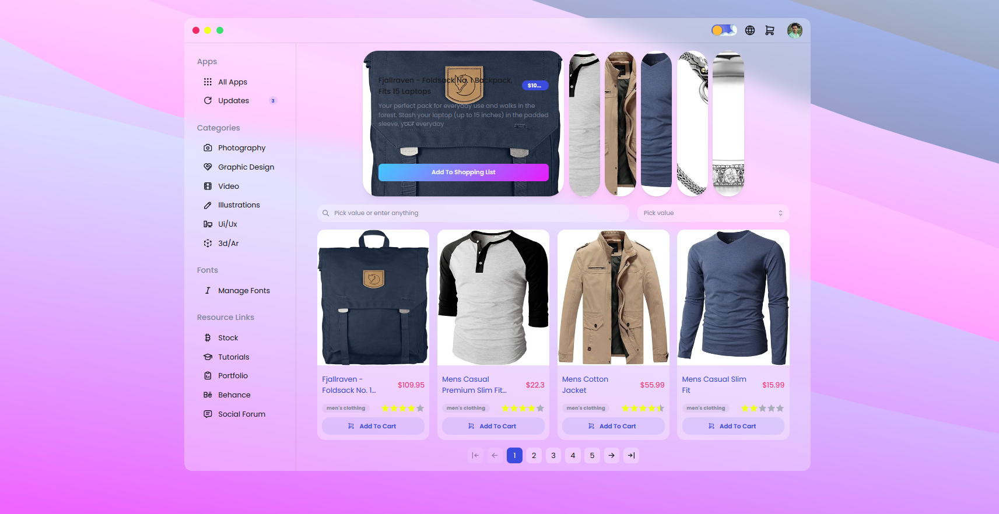
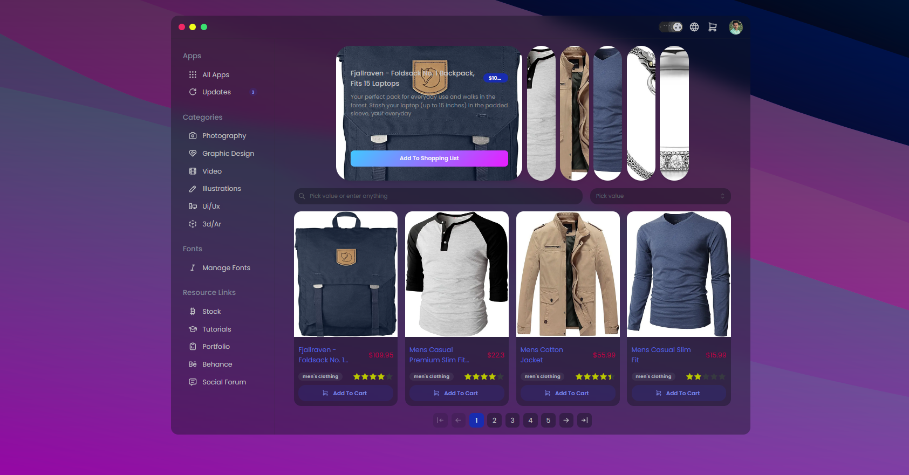
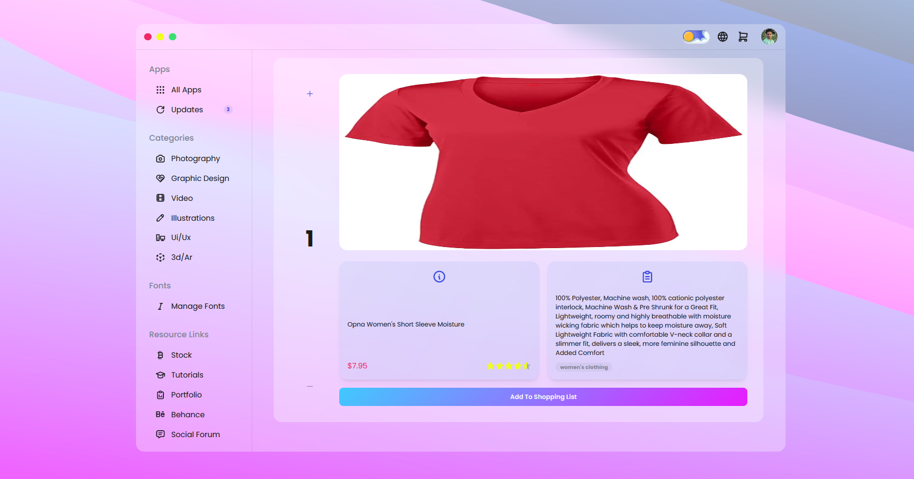

# Shopping Next.js 

This Layout made with Next.js, Mantine UI(with Tabler Icons and other depencies), TypeScript, Clerk Auth, Context Api, Spline, Framer motion, Clsx and Postcss with Plugins.

## [Demo Link](https://shopping-nextjs-temp.vercel.app/)






## Tech Stack

**Config** Npm, Eslint, Prettier, Stylelint, Husky with Lint-staged, Git flow and Vercel

## Features

- 3D Spline For Home Page with Pandacss
- Multiple Theme Colors
- Switch Color Scheme
- Custom Navigation for Mobile(Framer Motion) and Laptop 
- Product Items with Pagination, Search, Change Category, Placeholder and Error Components
- Single Product with Placeholder and Error Components
- Support Shopping List Item
- Many Reusable Hooks
- Custom Not Found Page
- Create User Auth with Clerk Auth, Next Auth with Supabase Auth
- Create Global State Management with Context Api and Reduxjs Toolkit with RTK Query
- Create Server State Management with React Query with Axios and Api Route
- Create Form Validation with: React Hook Form with Zod and Mantine Form
- Use Two Icon Libs: Tabler Icons and React Icons
- Multile Types for Api and Components Pros
- Many Utility Constants
- Multiple Utility Helpers

## Run Locally

Clone the project

```bash
  git clone https://github.com/AliBagheri2079/shopping-nextjs.git


```

Go to the project directory

```bash
  cd crypto-react


```

Install dependencies

```bash
  npm install


```

Start the server

```bash
  npm run dev


```

Format the Component

```bash
  npm run format


```

linting the Component

```bash
  npm run lint


```

## Deployment

To deploy this project run

```bash
  npm run deploy


```

## 🚀 About Me

I'm Ali Bagheri. Learning about 3 years on Frontend Development Position ...

## 🔗 Links

[](https://github.com/AliBagheri2079)

[](https://www.linkedin.com/in/alibagheri2079/)

[](https://twitter.com/AliBagheri2079)
